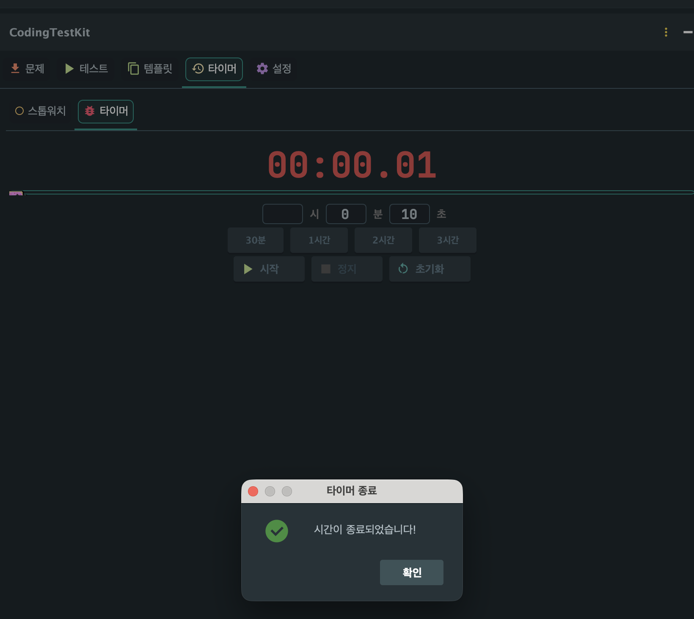

<p align="center">
  
</p>

<h1 align="center">CodingTestKit</h1>
<p align="center">
  IntelliJ IDE에서 알고리즘 문제를 <b>가져오고</b>, <b>테스트하고</b>, <b>제출</b>까지 한번에 할 수 있는 올인원 플러그인
</p>

---

## 왜 만들었나?

코딩테스트를 준비하면서 항상 불편했습니다. 문제를 풀려면 브라우저에서 문제를 읽고, IDE에서 코드를 작성하고, 다시 브라우저로 돌아가 제출하고... 이 과정을 반복해야 했습니다.

기존에도 문제를 가져오거나 제출을 도와주는 도구들은 있었지만, **실제 코딩테스트 환경을 그대로 재현**해주는 것은 없었습니다. 코딩테스트에서는 자동완성도 없고, 코드 검사도 없고, 시간 제한 안에서 풀어야 합니다.

CodingTestKit은 이런 **실제 시험 환경을 IDE 안에서 그대로 재현**하기 위해 만들었습니다:

- **시험 모드**: 자동완성과 코드 검사를 끄고, 외부 붙여넣기 차단과 포커스 이탈 감지까지 실전과 동일한 환경에서 연습
- **실행 시간 & 메모리 측정**: 테스트 케이스별 실행 시간(ms)과 메모리 사용량(KB/MB)을 표시
- **타이머**: 스톱워치와 카운트다운으로 실제 시험 시간을 관리
- **올인원**: 문제 읽기, 코드 작성, 테스트, 제출까지 IDE를 벗어나지 않고 전부 해결

브라우저와 IDE를 왔다갔다 하지 않고, **IntelliJ 하나로 코딩테스트의 모든 과정을 끝내는 것**이 이 플러그인의 목표입니다.

## 지원 플랫폼

| 플랫폼 | 문제 크롤링 | 로컬 테스트 | 코드 제출 |
|--------|:---------:|:---------:|:--------:|
| **백준 (BOJ)** | O | O | O |
| **프로그래머스** | O | O | O |
| **SWEA** | O | O | O |

## 지원 언어

| 언어 | 백준 | 프로그래머스 | SWEA |
|------|:----:|:----------:|:----:|
| Java | O | O | O |
| Python | O | O | O |
| C++ | O | O | O |
| Kotlin | O | O | X |

---

## 주요 기능

### 문제 가져오기

플랫폼과 언어를 선택하고 문제 번호만 입력하면 문제 설명, 테스트 케이스가 자동으로 추출됩니다.

<p align="center">
  
</p>

문제를 가져오면 프로젝트 내에 폴더가 자동 생성되고, 코드 파일과 README.md(문제 설명)가 만들어집니다.

<p align="center">
  
</p>

<p align="center">
  
</p>

- 백준: `problems/백준/Gold III/16236. 아기 상어/`
- 프로그래머스: `problems/프로그래머스/Level1/12937. 짝수와 홀수/`
- SWEA: `problems/SWEA/D3/1204. 최빈수 구하기/`

### 문제 보기

백준 #16236 "아기 상어" 문제를 예시로 살펴보겠습니다.

<p align="center">
  
</p>

플러그인 패널에서 문제 설명, 입출력 형식, 예제를 바로 확인할 수 있습니다. README.md 프리뷰도 함께 생성됩니다.

<p align="center">
  
  
</p>

<p align="center">
  
</p>

프로그래머스 문제도 입출력 예 테이블과 함께 표시됩니다.

<p align="center">
  
</p>

### 로그인 & 제출

내장 JCEF 브라우저를 통해 각 플랫폼에 로그인하고, 코드를 직접 제출할 수 있습니다.

<p align="center">
  
</p>

**제출** 버튼을 누르면 제출 확인 다이얼로그가 표시됩니다. 문제 정보, 언어, 파일 경로를 한눈에 확인하고 **예(Y)** 를 누르면 내장 브라우저가 열립니다.

<p align="center">
  
</p>

코드와 언어가 자동으로 입력됩니다. 만약 자동 입력이 되지 않는 경우 하단의 **코드 붙여넣기** 버튼을 누르면 코드가 자동으로 채워집니다. 사용자는 스크롤만 내려서 **제출** 버튼을 누르면 끝입니다.

<p align="center">
  
</p>

백준뿐만 아니라 **프로그래머스**, **SWEA**도 동일한 방식으로 로그인과 제출이 가능합니다.

### 로컬 테스트 실행

코드를 작성하고 **전체 실행**을 누르면 모든 테스트 케이스가 실행되어 PASS/FAIL 결과를 바로 확인할 수 있습니다. 각 테스트 케이스별로 **실행 시간(ms)**과 **메모리 사용량(KB/MB)**이 함께 표시됩니다.

<p align="center">
  
</p>

<p align="center">
  
</p>

FAIL인 케이스는 빨간색으로 표시되어 한눈에 확인할 수 있습니다.

<p align="center">
  
</p>

각 테스트 케이스를 펼치면 입력, 예상 출력, 실제 출력을 비교할 수 있습니다.

<p align="center">
  
</p>

프로그래머스의 solution 함수도 자동으로 래핑하여 테스트합니다.

<p align="center">
  
</p>

### 코드 에디터

문제를 가져오면 기본 코드가 자동 생성되어 에디터에서 바로 작성할 수 있습니다. 소스 루트가 자동 등록되어 자동완성과 컴파일이 정상 동작합니다.

<p align="center">
  
</p>

정답 코드를 작성하고 로컬에서 바로 테스트할 수 있습니다.

<p align="center">
  
</p>

### 코드 템플릿

코딩테스트에서 매번 반복되는 도입부(입출력 설정 등)를 템플릿으로 저장해두면 빠르게 넘길 수 있습니다. 구문 강조가 적용된 미리보기를 제공합니다.

<p align="center">
  
</p>

### 타이머

**스톱워치**와 **카운트다운 타이머**를 제공합니다. 스톱워치에는 랩 기록과 메모 기능이 있고, 카운트다운 타이머는 시간이 종료되면 알림을 표시합니다.

<p align="center">
  
</p>

<p align="center">
  
</p>

<p align="center">
  
</p>

### 설정 & 시험 모드

자동완성과 코드 검사를 끄고 켜는 **시험 모드**를 제공합니다. 실제 코딩테스트 환경과 동일한 조건에서 연습할 수 있습니다.

- **자동완성 ON/OFF**: 코드 자동완성 팝업을 끄고 켤 수 있습니다
- **코드 검사 ON/OFF**: 절전 모드를 활성화하여 백그라운드 분석을 중지합니다
- **외부 붙여넣기 차단**: 외부 프로그램에서 복사한 텍스트의 붙여넣기를 차단합니다 (IDE 내부 복사/붙여넣기는 정상 동작)
- **포커스 이탈 감지**: IDE 창에서 포커스가 벗어나면 경고를 표시합니다 (실제 시험에서 부정행위 방지와 동일)

**시험 모드** 버튼을 누르면 4가지 설정이 한 번에 적용되고, **일반 모드** 버튼을 누르면 모두 해제됩니다.

<p align="center">
  
</p>

#### 시험 모드 (자동완성 OFF)

시험 모드에서는 코드 자동완성과 검사가 비활성화됩니다. `Integer.`을 입력해도 자동완성 팝업이 표시되지 않아, 실제 시험과 동일한 환경에서 연습할 수 있습니다.

<p align="center">
  
</p>

<p align="center">
  
</p>

#### 일반 모드 (자동완성 ON)

일반 모드에서는 `Integer.`을 입력하면 `parseInt`, `bitCount` 등 메서드 목록이 자동으로 표시됩니다.

<p align="center">
  
</p>

<p align="center">
  
</p>

---

## 설치 방법

### JetBrains Marketplace
1. IntelliJ IDEA > Settings > Plugins > Marketplace
2. "CodingTestKit" 검색 후 설치

### 수동 설치
1. [Releases](https://github.com/dj258255/codingtestkit/releases)에서 `.zip` 파일 다운로드
2. IntelliJ IDEA > Settings > Plugins > 톱니바퀴 > Install Plugin from Disk

---

## 사용법

### 1. 문제 가져오기
1. 우측 사이드바에서 **CodingTestKit** 열기
2. 플랫폼과 언어 선택
3. 문제 번호 입력 후 **가져오기** 클릭
   - 백준: `1000` (문제 번호)
   - 프로그래머스: `12947` (URL의 `/lessons/` 뒤 숫자)
   - SWEA: `1204` (문제 번호)

### 2. 로그인
1. **로그인** 버튼 클릭
2. 내장 브라우저에서 해당 플랫폼에 로그인
3. 로그인 감지 시 자동으로 쿠키 저장 및 닫힘

### 3. 테스트 실행
1. **테스트** 탭 이동
2. 코드 작성 후 **전체 실행** 클릭
3. PASS/FAIL 결과 확인 (FAIL 시 자동 펼침)

### 4. 코드 제출
1. **제출** 버튼 클릭
2. 내장 브라우저에서 코드 자동 입력 확인
3. 제출 버튼 클릭 후 결과 확인

---

## 요구 사항

- IntelliJ IDEA 2024.1 이상
- JDK 17 이상 (Java 실행용)
- 각 언어 컴파일러 (해당 언어 테스트 시)

## 빌드

```bash
./gradlew buildPlugin
```

빌드된 플러그인은 `build/distributions/` 폴더에 생성됩니다.

## 라이선스

MIT License

## 제작자

- **dj258255** - [GitHub](https://github.com/dj258255)
