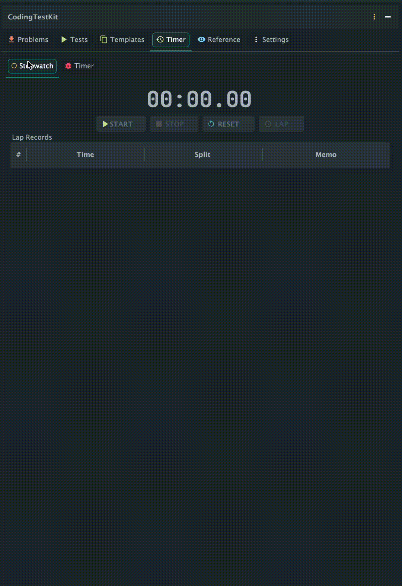

<p align="center">
  
</p>

<h1 align="center">CodingTestKit</h1>
<p align="center">
  An all-in-one IntelliJ plugin to <b>fetch</b>, <b>test</b>, and <b>submit</b> algorithm problems — all without leaving your IDE.<br/>
  <b>Programmers</b> · <b>SWEA</b> · <b>LeetCode</b> · <b>Codeforces</b>
</p>

<p align="center">
  <a href="https://plugins.jetbrains.com/plugin/30574-codingtestkit"></a>
</p>

<p align="center">
  <a href="#english"><b>English</b></a> &nbsp;|&nbsp; <a href="#한국어"><b>한국어</b></a>
</p>

---

<p align="center">
  
</p>

<p align="center">
  
  &nbsp;
  
</p>

<p align="center">
  
  &nbsp;
  
</p>

---

# English

## Why?

Preparing for coding tests has always been cumbersome — read the problem in a browser, write code in the IDE, switch back to the browser to submit, and repeat.

CodingTestKit was built to **replicate the real exam environment inside your IDE**:

- **Exam Mode**: Disable autocomplete & inspections, block external paste, detect focus loss — practice under real test conditions
- **Performance Metrics**: Show execution time (ms) and memory usage per test case
- **Timer**: Stopwatch, circular dial countdown timer, progress bar, digital clock
- **All-in-One**: Fetch, code, test, and submit without leaving the IDE
- **Problem Translation**: One-click Korean ↔ English translation with caching and rate limit protection
- **GitHub Push**: Auto-push accepted solutions to GitHub

## Supported Platforms

| Platform | Fetch | Test | Submit | Search | Random |
|----------|:-----:|:----:|:------:|:------:|:------:|
| **Programmers** | O | O | O | O | O |
| **SWEA** | O | O | O | O | O |
| **LeetCode** | O | O | O | O | O |
| **Codeforces** | O | O | O | O | O |

## Supported Languages

| Language | Programmers | SWEA | LeetCode | Codeforces |
|----------|:-----------:|:----:|:--------:|:----------:|
| Java | O | O | O | O |
| Python | O | O | O | O |
| C++ | O | O | O | O |
| Kotlin | O | X | O | O |

---

## Features

> Click any feature below to jump to the detailed section.

| # | Feature | Description |
|:-:|---------|-------------|
| 1 | [**Fetch Problems**](docs/features/fetch.md) | Fetch problem description & test cases from supported platforms |
| 2 | [**Problem View & Translation**](docs/features/problem-view.md) | View problems in-IDE with one-click KR↔EN translation |
| 3 | [**Local Test Execution**](docs/features/test.md) | Run all test cases locally with execution time & memory metrics |
| 4 | [**Login & Submit**](docs/features/submit.md) | Submit code directly via built-in browser with auto language selection |
| 5 | [**Problem Search**](docs/features/search.md) | Search problems on LeetCode, Codeforces, Programmers, and SWEA |
| 6 | [**Random Problem Picker**](docs/features/random.md) | Pick random problems with tier/difficulty/tag filters |
| 7 | [**Code Editor**](#code-editor) | Auto-generated boilerplate code per platform & language |
| 8 | [**Code Templates**](docs/features/templates.md) | Save & reuse frequently used code snippets |
| 9 | [**Timer**](docs/features/timer.md) | Stopwatch with laps + countdown with circular dial, progress bar, digital clock |
| 10 | [**Settings & Exam Mode**](docs/features/exam-mode.md) | One-click exam mode: block paste, disable autocomplete, focus alert |
| 11 | [**GitHub Integration**](docs/features/github.md) | Auto-push accepted solutions to GitHub |
| 12 | [**Internationalization**](#internationalization-i18n) | Full Korean / English UI support |

---

### Fetch Problems

Select the platform and language, enter a problem number, and the problem description and test cases are automatically extracted.

- **Programmers**: Number after `/lessons/` in URL (e.g., `12947`)
- **SWEA**: Enter problem number or paste URL
- **LeetCode**: Enter number, slug, or URL (e.g., `1`, `two-sum`, full URL)
- **Codeforces**: contestId+letter (e.g., `1234A`) or URL

<p align="center">
  
</p>

When a problem is fetched, a folder is automatically created with a code file and README.md (problem description).

<p align="center">
  
</p>

<p align="center">
  
</p>

<p align="right"><a href="#features">Back to Features</a></p>

---

### Problem View & Translation

<p align="center">
  
</p>

View the problem description, I/O format, and examples directly in the plugin panel.

#### Problem Translation (KR ↔ EN)

Translate problem descriptions between Korean and English with one click.

- **Toggle Translation**: Click the Translate button to switch between original and translated text
- **Auto Language Detection**: Automatically detects Korean/English and translates to the other language
- **Translation Caching**: Translated results are cached — no repeated API calls for the same problem
- **Rate Limit Protection**: Built-in request throttling and exponential backoff retry to prevent IP blocking
- Uses the same Google Translate unofficial API used by popular IntelliJ translation plugins (e.g., YiiGuxing Translation Plugin)

<p align="center">
  
  
</p>

<p align="center">
  
</p>

Programmers problems are also displayed with I/O example tables.

<p align="center">
  
</p>

<p align="right"><a href="#features">Back to Features</a></p>

---

### Local Test Execution

Write your code and click **Run All** to execute all test cases and see PASS/FAIL results instantly. Each test case shows **execution time (ms)** and **memory usage (KB/MB)**.

<p align="center">
  
</p>

<p align="center">
  
</p>

Failed cases are highlighted in red and auto-expanded.

<p align="center">
  
</p>

<p align="center">
  
</p>

Programmers and LeetCode solution functions are automatically wrapped for testing.

<p align="center">
  
</p>

<p align="right"><a href="#features">Back to Features</a></p>

---

### Login & Submit

Log in to each platform via the built-in JCEF browser and submit your code directly. The language dropdown is **automatically selected** to match your code.

<p align="center">
  
</p>

Click **Submit**, confirm the dialog, and your code & language are auto-filled.

<p align="center">
  
</p>

<p align="center">
  
</p>

<p align="right"><a href="#features">Back to Features</a></p>

---

### Problem Search

#### LeetCode

- **Keyword Search**: Search by title or keyword
- **Difficulty Filter**: Filter by Easy, Medium, Hard
- **Tag Filter**: Filter by algorithm tags (Array, DP, Graph, etc.)
- **Auto Search**: Debounced auto-search while typing

#### Codeforces / Programmers / SWEA

Each platform supports keyword, tag, and difficulty search via its own dialog.

<p align="right"><a href="#features">Back to Features</a></p>

---

### Random Problem Picker

<p align="center">
  
</p>

#### LeetCode

- **Difficulty Checkboxes**: Select multiple difficulties (Easy, Medium, Hard)
- **Tag Chips**: Select/remove tags as chips (Array, DP, Graph, etc.)
- **Accepted Filter**: Exclude obscure problems by minimum accepted count (e.g., ≥1000)
- **Solved Filter**: All / Exclude my solved / Only my solved (uses LeetCode login session)
- **Count**: Set number of problems to pick (1–20)

#### Codeforces / Programmers / SWEA

Each platform supports rating/level range + tag-based random picking.

<p align="right"><a href="#features">Back to Features</a></p>

---

### Code Editor

When a problem is fetched, boilerplate code is auto-generated so you can start coding immediately.

<p align="center">
  
</p>

<p align="right"><a href="#features">Back to Features</a></p>

---

### Code Templates

Save frequently used boilerplate as templates for quick access. Syntax-highlighted preview included.

<p align="center">
  
</p>

<p align="right"><a href="#features">Back to Features</a></p>

---

### Timer

Provides a **Stopwatch** and a **Countdown Timer**.

- **Stopwatch**: Lap records with memo
- **Countdown**: 3 display modes selectable via checkboxes
  - **Circular Dial Timer**: Remaining time shown as a red circle, elapsed time as a white gap growing clockwise
  - **Digital Clock**: Large numerical time display
  - **Progress Bar**: Linear progress indicator
- Preset buttons for 30min, 1hr, 2hr, 3hr
- Notification when time's up

<p align="center">
  
</p>

<p align="right"><a href="#features">Back to Features</a></p>

---

### Settings & Exam Mode

- **Auto Complete ON/OFF**: Toggle code auto-completion popups
- **Inspections ON/OFF**: Enable power save mode to stop background analysis
- **Paste Block**: Block pasting text copied from external programs
- **Focus Alert**: Show alert when IDE window loses focus
- **Language**: Switch between Korean / English

One-click **Exam Mode** enables all 4 restrictions; **Normal Mode** disables them all.

<p align="center">
  
</p>

<p align="right"><a href="#features">Back to Features</a></p>

---

### GitHub Integration

Push your accepted solutions to GitHub automatically.

- **One-Click Login**: Log in to GitHub via built-in browser — token is auto-generated and saved
- **Repo Selector**: Choose from your repositories via dropdown after login
- **Auto Push**: Automatically push code to GitHub when your submission is accepted
- **Manual Push**: Click the GitHub button to push anytime
- **Smart Detection**: Only pushes on "Accepted" — wrong answers are never pushed
- **All Platforms**: Works with Programmers, SWEA, LeetCode, and Codeforces
- **Structured Commits**: `[Platform #ID] Problem Title (Language)` format with README

Setup: Settings > GitHub Integration > Click "GitHub Login" and select your repository.

<p align="right"><a href="#features">Back to Features</a></p>

---

### Internationalization (i18n)

Switch between **Korean / English** in settings. All UI text is displayed in the selected language.

<p align="right"><a href="#features">Back to Features</a></p>

---

## Installation

### JetBrains Marketplace
1. **[Install from Marketplace](https://plugins.jetbrains.com/plugin/30574-codingtestkit)** — or open IntelliJ IDEA > Settings > Plugins > Marketplace
2. Search "CodingTestKit" and install

### Manual Install
1. Download `.zip` from [Releases](https://github.com/dj258255/codingtestkit/releases)
2. IntelliJ IDEA > Settings > Plugins > ⚙ > Install Plugin from Disk

## Quick Start

1. Open **CodingTestKit** from the right sidebar
2. Select platform and language
3. Enter problem ID and click **Fetch**
4. Write code, click **Run All**
5. Click **Submit**, verify in built-in browser

## Requirements

- IntelliJ IDEA 2024.1+
- JDK 17+ (for Java execution)
- Language compilers (for respective language tests)

## Build

```bash
./gradlew buildPlugin
```

---

# 한국어

## 왜 만들었나?

코딩테스트를 준비하면서 항상 불편했습니다. 문제를 풀려면 브라우저에서 문제를 읽고, IDE에서 코드를 작성하고, 다시 브라우저로 돌아가 제출하고... 이 과정을 반복해야 했습니다.

CodingTestKit은 **실제 시험 환경을 IDE 안에서 그대로 재현**하기 위해 만들었습니다:

- **시험 모드**: 자동완성과 코드 검사를 끄고, 외부 붙여넣기 차단과 포커스 이탈 감지까지 실전과 동일한 환경에서 연습
- **실행 시간 & 메모리 측정**: 테스트 케이스별 실행 시간(ms)과 메모리 사용량(KB/MB)을 표시
- **타이머**: 스톱워치, 원형 다이얼 카운트다운 타이머, 프로그레스 바, 디지털 시계
- **올인원**: 문제 읽기, 코드 작성, 테스트, 제출까지 IDE를 벗어나지 않고 전부 해결
- **문제 번역**: 한 클릭으로 한국어 ↔ 영어 번역 (캐싱 및 rate limit 보호 내장)
- **GitHub 연동**: 채점 통과 시 자동으로 GitHub에 푸시

## 지원 플랫폼

| 플랫폼 | 문제 가져오기 | 로컬 테스트 | 코드 제출 | 검색 | 랜덤 |
|--------|:---------:|:---------:|:--------:|:----:|:----:|
| **프로그래머스** | O | O | O | O | O |
| **SWEA** | O | O | O | O | O |
| **LeetCode** | O | O | O | O | O |
| **Codeforces** | O | O | O | O | O |

## 지원 언어

| 언어 | 프로그래머스 | SWEA | LeetCode | Codeforces |
|------|:----------:|:----:|:--------:|:----------:|
| Java | O | O | O | O |
| Python | O | O | O | O |
| C++ | O | O | O | O |
| Kotlin | O | X | O | O |

---

## 주요 기능

> 아래 기능을 클릭하면 해당 섹션으로 이동합니다.

| # | 기능 | 설명 |
|:-:|------|------|
| 1 | [**문제 가져오기**](docs/features/fetch.md) | 지원 플랫폼에서 문제 설명 & 테스트 케이스 자동 추출 |
| 2 | [**문제 보기 & 번역**](docs/features/problem-view.md) | IDE 내에서 문제 확인 + 한/영 원클릭 번역 |
| 3 | [**로컬 테스트 실행**](docs/features/test.md) | 모든 테스트 케이스 로컬 실행 + 실행 시간 & 메모리 측정 |
| 4 | [**로그인 & 제출**](docs/features/submit.md) | 내장 브라우저로 코드 제출 + 언어 자동 선택 |
| 5 | [**문제 검색**](docs/features/search.md) | LeetCode, Codeforces, 프로그래머스, SWEA 문제 검색 |
| 6 | [**랜덤 문제 뽑기**](docs/features/random.md) | 티어/난이도/태그 필터로 랜덤 문제 추천 |
| 7 | [**코드 에디터**](#코드-에디터) | 플랫폼 & 언어별 보일러플레이트 코드 자동 생성 |
| 8 | [**코드 템플릿**](docs/features/templates.md) | 자주 쓰는 코드 스니펫 저장 & 재사용 |
| 9 | [**타이머**](docs/features/timer.md) | 스톱워치 + 원형 다이얼/프로그레스 바/디지털 시계 카운트다운 |
| 10 | [**설정 & 시험 모드**](docs/features/exam-mode.md) | 원클릭 시험 모드: 붙여넣기 차단, 자동완성 끄기, 포커스 감지 |
| 11 | [**GitHub 연동**](docs/features/github.md) | 맞은 문제 자동 GitHub 푸시 |
| 12 | [**다국어 지원**](#다국어-지원-i18n) | 한국어 / English UI 완전 지원 |

---

### 문제 가져오기

플랫폼과 언어를 선택하고 문제 번호만 입력하면 문제 설명, 테스트 케이스가 자동으로 추출됩니다.

- **프로그래머스**: URL의 `/lessons/` 뒤 숫자 (예: `12947`)
- **SWEA**: 문제 번호 또는 URL 붙여넣기
- **LeetCode**: 문제 번호, slug, 또는 URL 입력 (예: `1`, `two-sum`, URL)
- **Codeforces**: 콘테스트번호+문제번호 (예: `1234A`) 또는 URL

<p align="center">
  
</p>

문제를 가져오면 프로젝트 내에 폴더가 자동 생성되고, 코드 파일과 README.md(문제 설명)가 만들어집니다.

<p align="center">
  
</p>

<p align="center">
  
</p>

<p align="right"><a href="#주요-기능">기능 목록으로</a></p>

---

### 문제 보기 & 번역

<p align="center">
  
</p>

플러그인 패널에서 문제 설명, 입출력 형식, 예제를 바로 확인할 수 있습니다.

#### 문제 번역 (한 ↔ 영)

문제 설명을 한국어 ↔ 영어로 한 클릭에 번역합니다.

- **토글 번역**: 번역 버튼 클릭으로 원문/번역 전환
- **자동 언어 감지**: 한국어/영어를 자동 감지하여 반대 언어로 번역
- **번역 캐싱**: 번역 결과를 캐시하여 같은 문제를 다시 번역하지 않음
- **Rate Limit 보호**: 요청 간 딜레이 및 exponential backoff 재시도로 IP 차단 방지
- IntelliJ 번역 플러그인(YiiGuxing Translation Plugin 등)과 동일한 Google Translate 비공식 API 사용

<p align="center">
  
  
</p>

<p align="center">
  
</p>

프로그래머스 문제도 입출력 예 테이블과 함께 표시됩니다.

<p align="center">
  
</p>

<p align="right"><a href="#주요-기능">기능 목록으로</a></p>

---

### 로컬 테스트 실행

코드를 작성하고 **전체 실행**을 누르면 모든 테스트 케이스가 실행되어 PASS/FAIL 결과를 바로 확인할 수 있습니다. 각 테스트 케이스별로 **실행 시간(ms)**과 **메모리 사용량(KB/MB)**이 함께 표시됩니다.

<p align="center">
  
</p>

<p align="center">
  
</p>

FAIL인 케이스는 빨간색으로 표시되어 한눈에 확인할 수 있습니다.

<p align="center">
  
</p>

<p align="center">
  
</p>

프로그래머스와 LeetCode의 solution 함수도 자동으로 래핑하여 테스트합니다.

<p align="center">
  
</p>

<p align="right"><a href="#주요-기능">기능 목록으로</a></p>

---

### 로그인 & 제출

내장 JCEF 브라우저를 통해 각 플랫폼에 로그인하고, 코드를 직접 제출할 수 있습니다. 제출 시 코드 작성 언어에 맞춰 **언어 드롭다운이 자동 선택**됩니다.

<p align="center">
  
</p>

**제출** 버튼을 누르면 제출 확인 다이얼로그가 표시되고, 코드와 언어가 자동으로 입력됩니다.

<p align="center">
  
</p>

<p align="center">
  
</p>

<p align="right"><a href="#주요-기능">기능 목록으로</a></p>

---

### 문제 검색

#### LeetCode

- **키워드 검색**: 문제 제목이나 키워드로 검색
- **난이도 필터**: Easy, Medium, Hard 필터링
- **태그 필터**: Array, DP, Graph 등 알고리즘 태그로 필터링
- **자동 검색**: 입력 시 자동으로 검색 (디바운스 적용)

#### Codeforces / 프로그래머스 / SWEA

각 플랫폼의 공식 API 또는 목록 페이지를 활용해 키워드·태그·난이도로 검색합니다.

<p align="right"><a href="#주요-기능">기능 목록으로</a></p>

---

### 랜덤 문제 뽑기

<p align="center">
  
</p>

#### LeetCode

- **난이도 체크박스**: Easy, Medium, Hard 중 원하는 난이도 복수 선택
- **태그 칩 선택**: Array, DP, Graph 등 태그를 칩으로 선택/제거
- **정답자 수 필터**: 정답자 N명 이상인 문제만 표시 (듣보 문제 제외, 기본 1000명)
- **풀이 필터**: 전체 / 내가 푼 문제 제외 / 내가 푼 문제에서만 (LeetCode 로그인 세션 활용)
- **개수 설정**: 뽑을 문제 수 지정 (1~20개)

#### Codeforces / 프로그래머스 / SWEA

각 플랫폼별 레이팅/레벨 범위와 태그 기반 랜덤 뽑기를 지원합니다.

<p align="right"><a href="#주요-기능">기능 목록으로</a></p>

---

### 코드 에디터

문제를 가져오면 기본 코드가 자동 생성되어 에디터에서 바로 작성할 수 있습니다.

<p align="center">
  
</p>

<p align="right"><a href="#주요-기능">기능 목록으로</a></p>

---

### 코드 템플릿

자주 쓰는 코드를 템플릿으로 저장해두면 빠르게 불러올 수 있습니다. 구문 강조가 적용된 미리보기를 제공합니다.

<p align="center">
  
</p>

<p align="right"><a href="#주요-기능">기능 목록으로</a></p>

---

### 타이머

**스톱워치**와 **카운트다운 타이머**를 제공합니다.

- **스톱워치**: 랩 기록과 메모 기능
- **카운트다운**: 3가지 표시 모드를 체크박스로 선택 가능
  - **원형 다이얼 타이머**: 남은 시간이 빨간 원으로, 경과 시간이 빈 갭으로 시계방향으로 줄어듦
  - **디지털 시계**: 큰 숫자로 남은 시간 표시
  - **프로그레스 바**: 막대형 진행률 표시
- 30분, 1시간, 2시간, 3시간 프리셋 버튼
- 시간 종료 시 알림

<p align="center">
  
</p>

<p align="right"><a href="#주요-기능">기능 목록으로</a></p>

---

### 설정 & 시험 모드

- **자동완성 ON/OFF**: 코드 자동완성 팝업을 끄고 켤 수 있습니다
- **코드 검사 ON/OFF**: 절전 모드를 활성화하여 백그라운드 분석을 중지합니다
- **외부 붙여넣기 차단**: 외부 프로그램에서 복사한 텍스트의 붙여넣기를 차단합니다
- **포커스 이탈 감지**: IDE 창에서 포커스가 벗어나면 경고를 표시합니다
- **언어 설정**: 한국어 / English 전환 가능

**시험 모드** 버튼을 누르면 4가지 설정이 한 번에 적용되고, **일반 모드** 버튼을 누르면 모두 해제됩니다.

<p align="center">
  
</p>

<p align="right"><a href="#주요-기능">기능 목록으로</a></p>

---

### GitHub 연동

맞은 문제를 자동으로 GitHub에 푸시합니다.

- **원클릭 로그인**: 내장 브라우저에서 GitHub에 로그인하면 토큰이 자동 생성 및 저장
- **레포 선택**: 로그인 후 드롭다운에서 레포 선택
- **자동 푸시**: 채점 결과가 "맞았습니다"일 때만 자동으로 GitHub에 커밋
- **수동 푸시**: GitHub 버튼을 눌러서 원할 때 직접 푸시
- **스마트 감지**: 틀린 코드는 절대 푸시하지 않음 — "Accepted"일 때만 동작
- **전 플랫폼 지원**: 프로그래머스, SWEA, LeetCode, Codeforces 모두 지원
- **구조화된 커밋**: `[플랫폼 #번호] 문제 제목 (언어)` 형식 + README 자동 생성

설정: 설정 > GitHub 연동 > "GitHub 로그인" 클릭 후 레포 선택.

<p align="right"><a href="#주요-기능">기능 목록으로</a></p>

---

### 다국어 지원 (i18n)

설정에서 **한국어 / English** 전환이 가능합니다. 모든 UI 텍스트가 선택한 언어로 표시됩니다.

<p align="right"><a href="#주요-기능">기능 목록으로</a></p>

---

## 설치 방법

### JetBrains Marketplace
1. **[Marketplace에서 설치](https://plugins.jetbrains.com/plugin/30574-codingtestkit)** — 또는 IntelliJ IDEA > Settings > Plugins > Marketplace
2. "CodingTestKit" 검색 후 설치

### 수동 설치
1. [Releases](https://github.com/dj258255/codingtestkit/releases)에서 `.zip` 파일 다운로드
2. IntelliJ IDEA > Settings > Plugins > 톱니바퀴 > Install Plugin from Disk

## 빠른 시작

1. 우측 사이드바에서 **CodingTestKit** 열기
2. 플랫폼과 언어 선택
3. 문제 번호 입력 후 **가져오기** 클릭
4. 코드 작성 후 **전체 실행** 클릭
5. **제출** 버튼 클릭, 내장 브라우저에서 확인

## 요구 사항

- IntelliJ IDEA 2024.1 이상
- JDK 17 이상 (Java 실행용)
- 각 언어 컴파일러 (해당 언어 테스트 시)

## 빌드

```bash
./gradlew buildPlugin
```

---

## License

MIT License — **dj258255** ([GitHub](https://github.com/dj258255))
