<p align="center">
  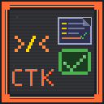
</p>

<h1 align="center">CodingTestKit</h1>
<p align="center">
  IntelliJ IDE에서 알고리즘 문제를 <b>가져오고</b>, <b>테스트하고</b>, <b>제출</b>까지 한번에 할 수 있는 올인원 플러그인
</p>
<p align="center">
  <b>백준</b> · <b>프로그래머스</b> · <b>SWEA</b> · <b>LeetCode</b> &nbsp;|&nbsp; 🌐 한국어 / English
</p>

---

## 왜 만들었나?

코딩테스트를 준비하면서 항상 불편했습니다. 문제를 풀려면 브라우저에서 문제를 읽고, IDE에서 코드를 작성하고, 다시 브라우저로 돌아가 제출하고... 이 과정을 반복해야 했습니다.

기존에도 문제를 가져오거나 제출을 도와주는 도구들은 있었지만, **실제 코딩테스트 환경을 그대로 재현**해주는 것은 없었습니다.

CodingTestKit은 이런 **실제 시험 환경을 IDE 안에서 그대로 재현**하기 위해 만들었습니다:

- **시험 모드**: 자동완성과 코드 검사를 끄고, 외부 붙여넣기 차단과 포커스 이탈 감지까지 실전과 동일한 환경에서 연습
- **실행 시간 & 메모리 측정**: 테스트 케이스별 실행 시간(ms)과 메모리 사용량(KB/MB)을 표시
- **타이머**: 스톱워치, 원형 다이얼 카운트다운 타이머, 프로그레스 바, 디지털 시계
- **올인원**: 문제 읽기, 코드 작성, 테스트, 제출까지 IDE를 벗어나지 않고 전부 해결
- **문제 번역**: 한 클릭으로 한국어 ↔ 영어 번역 (캐싱 및 rate limit 보호 내장)
- **GitHub 연동**: 채점 통과 시 자동으로 GitHub에 푸시 (백준허브 스타일)

## 지원 플랫폼

| 플랫폼 | 문제 가져오기 | 로컬 테스트 | 코드 제출 | 검색 | 랜덤 |
|--------|:---------:|:---------:|:--------:|:----:|:----:|
| **백준 (BOJ)** | O | O | O | O | O |
| **프로그래머스** | O | O | O | - | - |
| **SWEA** | O | O | O | - | - |
| **LeetCode** | O | O | O | O | O |

## 지원 언어

| 언어 | 백준 | 프로그래머스 | SWEA | LeetCode |
|------|:----:|:----------:|:----:|:--------:|
| Java | O | O | O | O |
| Python | O | O | O | O |
| C++ | O | O | O | O |
| Kotlin | O | O | X | O |

---

## 주요 기능

### 다국어 지원 (i18n)

설정에서 **한국어 / English** 전환이 가능합니다. 모든 UI 텍스트가 선택한 언어로 표시됩니다. 언어 변경 안내문은 한·영 동시에 표시됩니다.

### 문제 가져오기

플랫폼과 언어를 선택하고 문제 번호만 입력하면 문제 설명, 테스트 케이스가 자동으로 추출됩니다.

- **백준**: 문제 번호 입력 (예: `1000`)
- **프로그래머스**: URL의 `/lessons/` 뒤 숫자 (예: `12947`)
- **SWEA**: 문제 번호 또는 URL 붙여넣기
- **LeetCode**: 문제 번호, slug, 또는 URL 입력 (예: `1`, `two-sum`, URL)

<p align="center">
  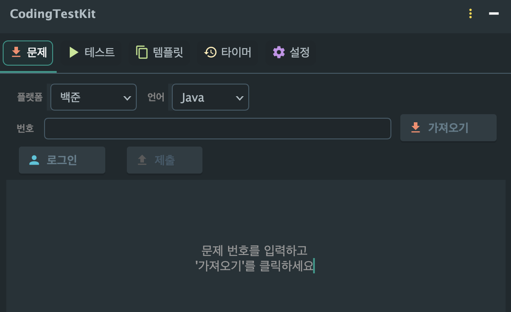
</p>

문제를 가져오면 프로젝트 내에 폴더가 자동 생성되고, 코드 파일과 README.md(문제 설명)가 만들어집니다.

<p align="center">
  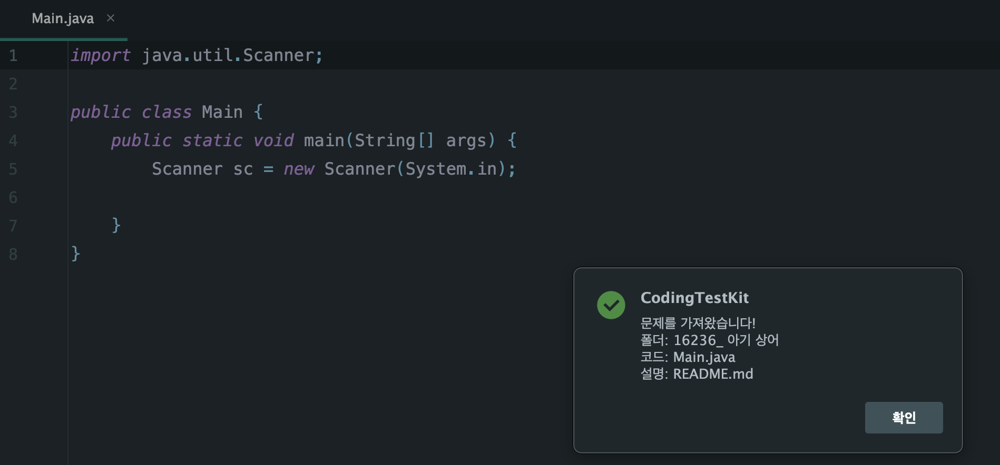
</p>

<p align="center">
  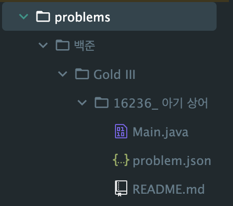
</p>

- 백준: `problems/백준/Gold III/16236. 아기 상어/`
- 프로그래머스: `problems/프로그래머스/Level1/12937. 짝수와 홀수/`
- SWEA: `problems/SWEA/D3/1204. 최빈수 구하기/`
- LeetCode: `problems/LeetCode/Medium/1. Two Sum/`

### 문제 보기 & 번역

<p align="center">
  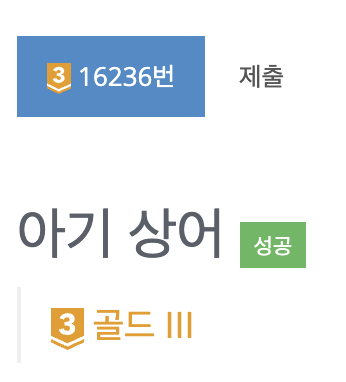
</p>

플러그인 패널에서 문제 설명, 입출력 형식, 예제를 바로 확인할 수 있습니다.

#### 문제 번역 (한 ↔ 영)

문제 설명을 한국어 ↔ 영어로 한 클릭에 번역합니다.

- **토글 번역**: 번역 버튼 클릭으로 원문/번역 전환
- **자동 언어 감지**: 한국어/영어를 자동 감지하여 반대 언어로 번역
- **번역 캐싱**: 번역 결과를 캐시하여 같은 문제를 다시 번역하지 않음
- **Rate Limit 보호**: 요청 간 딜레이 및 exponential backoff 재시도로 IP 차단 방지
- IntelliJ 번역 플러그인(YiiGuxing Translation Plugin 등)과 동일한 Google Translate 비공식 API 사용

<p align="center">
  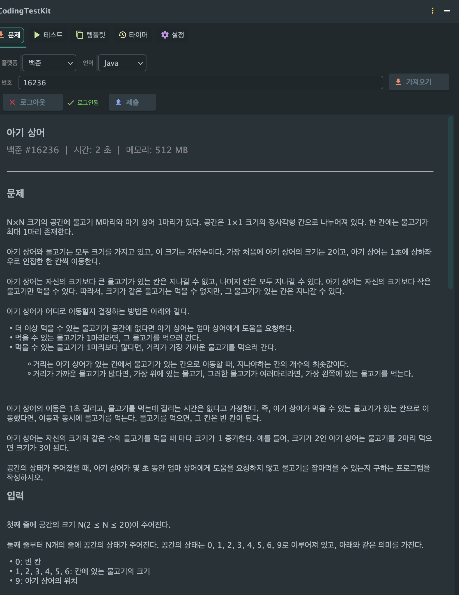
  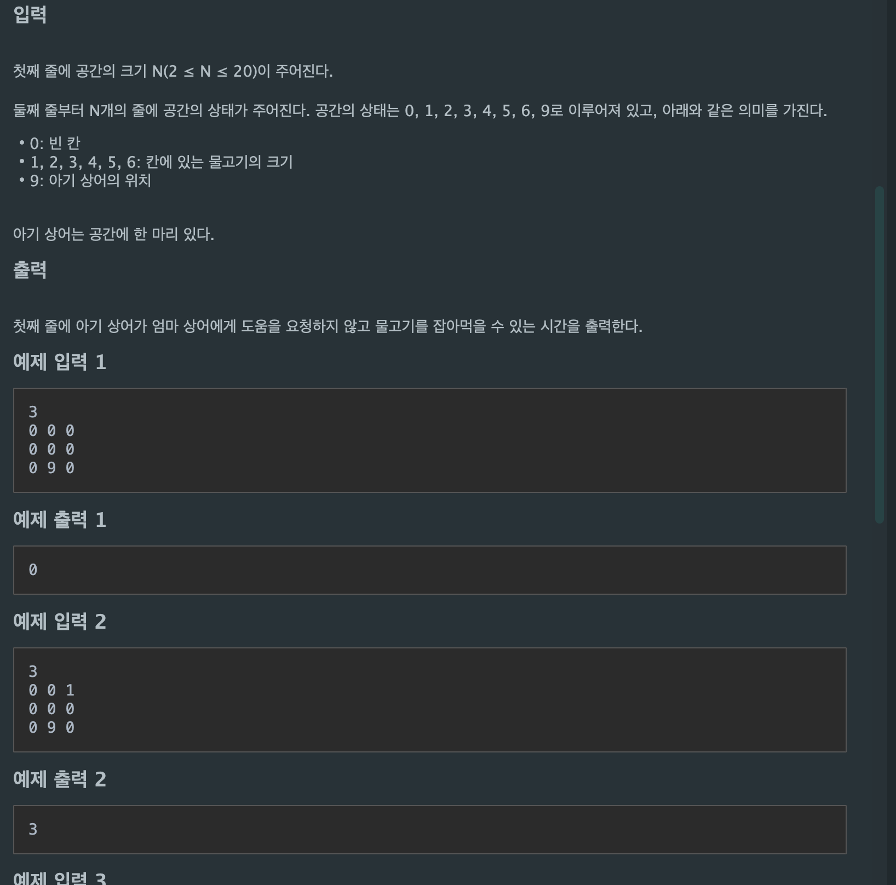
</p>

<p align="center">
  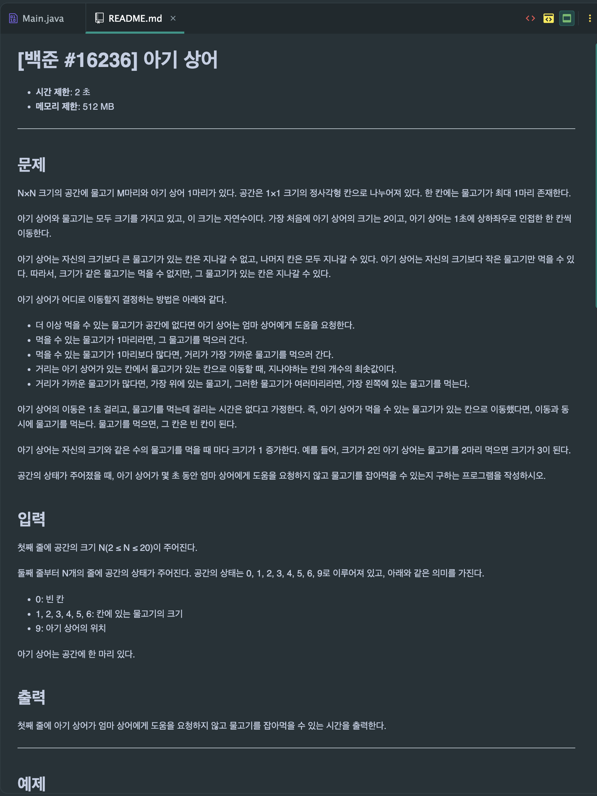
</p>

프로그래머스 문제도 입출력 예 테이블과 함께 표시됩니다.

<p align="center">
  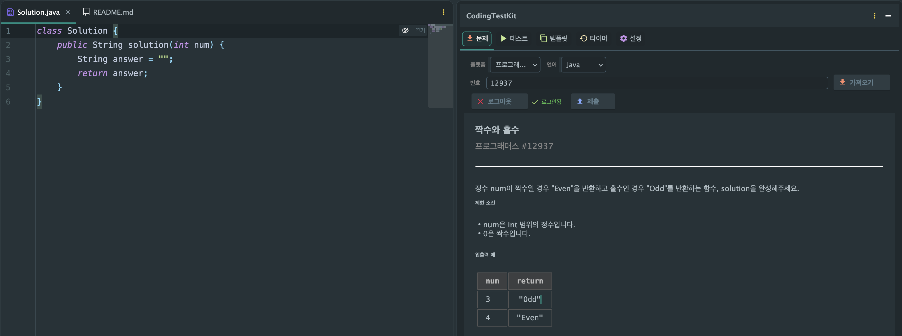
</p>

### 문제 검색

#### 백준 (solved.ac)

solved.ac 기반의 백준 문제 검색을 지원합니다.

- **자동완성**: 문제 번호나 제목을 입력하면 실시간으로 검색 결과 표시
- **정렬 옵션**: 난이도순, 번호순, 제목순, 푼 사람순으로 정렬
- **바로 가져오기**: 검색 결과에서 더블클릭으로 즉시 가져오기

#### LeetCode

LeetCode 문제를 키워드, 난이도, 알고리즘 태그로 검색합니다.

- **키워드 검색**: 문제 제목이나 키워드로 검색
- **난이도 필터**: Easy, Medium, Hard 필터링
- **태그 필터**: Array, DP, Graph 등 알고리즘 태그로 필터링
- **자동 검색**: 입력 시 자동으로 검색 (디바운스 적용)

### 랜덤 문제 뽑기

#### 백준 (solved.ac)

solved.ac API를 활용하여 백준 문제를 랜덤으로 뽑을 수 있습니다.

- **티어 범위 설정**: Bronze V ~ Ruby I 까지 원하는 난이도 범위 지정
- **클래스 필터**: Class 1~10 기준으로 문제 필터링
- **알고리즘 태그 칩**: 선택한 태그가 칩/뱃지로 표시되며, × 클릭으로 개별 제거 가능
- **내가 푼 문제 제외**: BOJ 핸들 입력으로 이미 푼 문제를 제외
- **듣보 문제 제외**: 맞은 사람 100명 이하인 문제 제외
- **즉시 가져오기**: 뽑힌 문제를 더블클릭으로 바로 가져오기

#### LeetCode

- **난이도 체크박스**: Easy, Medium, Hard 중 원하는 난이도 복수 선택
- **태그 칩 선택**: Array, DP, Graph 등 태그를 칩으로 선택/제거
- **개수 설정**: 뽑을 문제 수 지정 (1~20개)

> 프로그래머스와 SWEA는 검색/랜덤 기능을 지원하지 않습니다.

### 로그인 & 제출

내장 JCEF 브라우저를 통해 각 플랫폼에 로그인하고, 코드를 직접 제출할 수 있습니다.

<p align="center">
  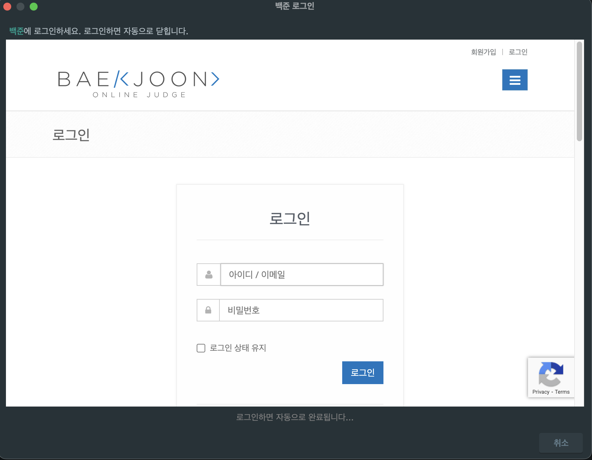
</p>

**제출** 버튼을 누르면 제출 확인 다이얼로그가 표시됩니다.

<p align="center">
  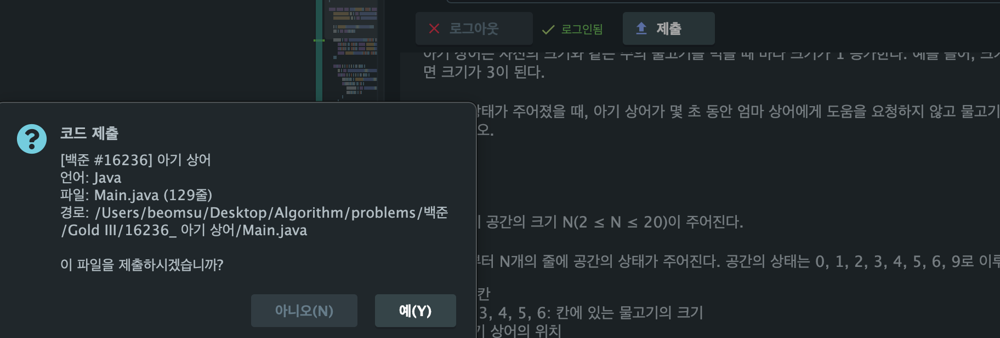
</p>

코드와 언어가 자동으로 입력됩니다. 사용자는 스크롤만 내려서 **제출** 버튼을 누르면 끝입니다.

<p align="center">
  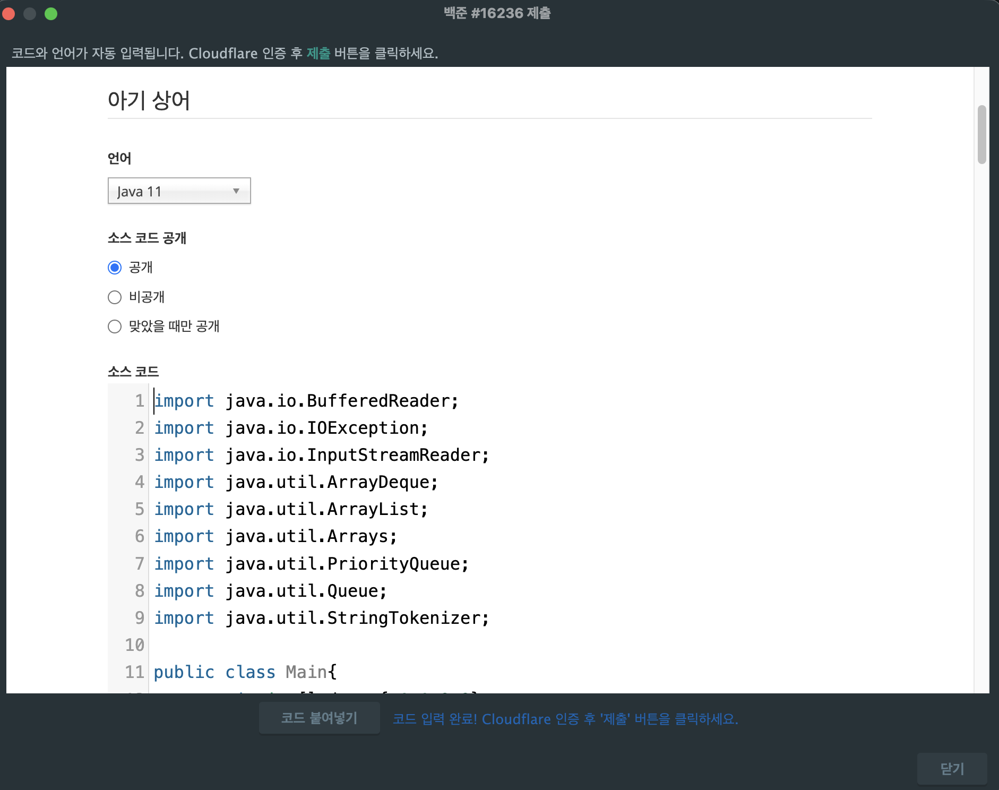
</p>

백준뿐만 아니라 **프로그래머스**, **SWEA**, **LeetCode**도 동일한 방식으로 로그인과 제출이 가능합니다.

### 로컬 테스트 실행

코드를 작성하고 **전체 실행**을 누르면 모든 테스트 케이스가 실행되어 PASS/FAIL 결과를 바로 확인할 수 있습니다. 각 테스트 케이스별로 **실행 시간(ms)**과 **메모리 사용량(KB/MB)**이 함께 표시됩니다.

<p align="center">
  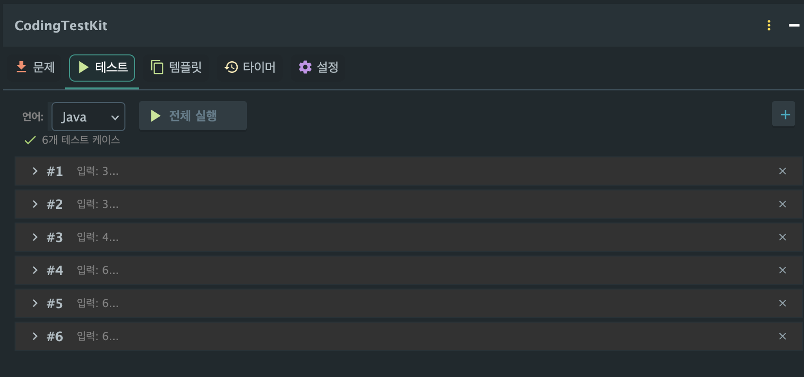
</p>

<p align="center">
  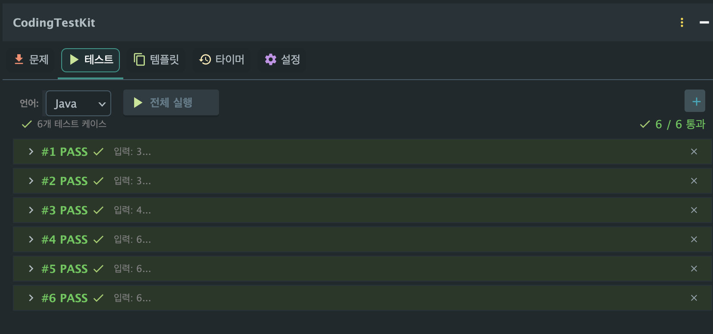
</p>

FAIL인 케이스는 빨간색으로 표시되어 한눈에 확인할 수 있습니다.

<p align="center">
  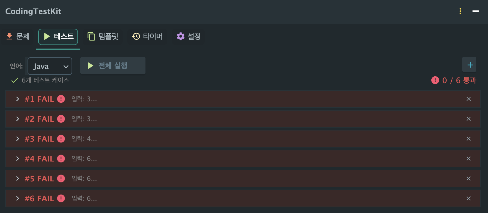
</p>

각 테스트 케이스를 펼치면 입력, 예상 출력, 실제 출력을 비교할 수 있습니다.

<p align="center">
  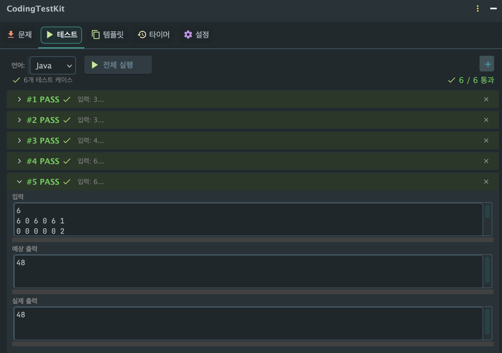
</p>

프로그래머스와 LeetCode의 solution 함수도 자동으로 래핑하여 테스트합니다.

<p align="center">
  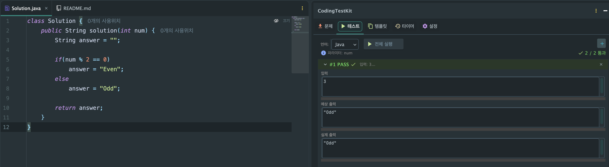
</p>

### 코드 에디터

문제를 가져오면 기본 코드가 자동 생성되어 에디터에서 바로 작성할 수 있습니다.

<p align="center">
  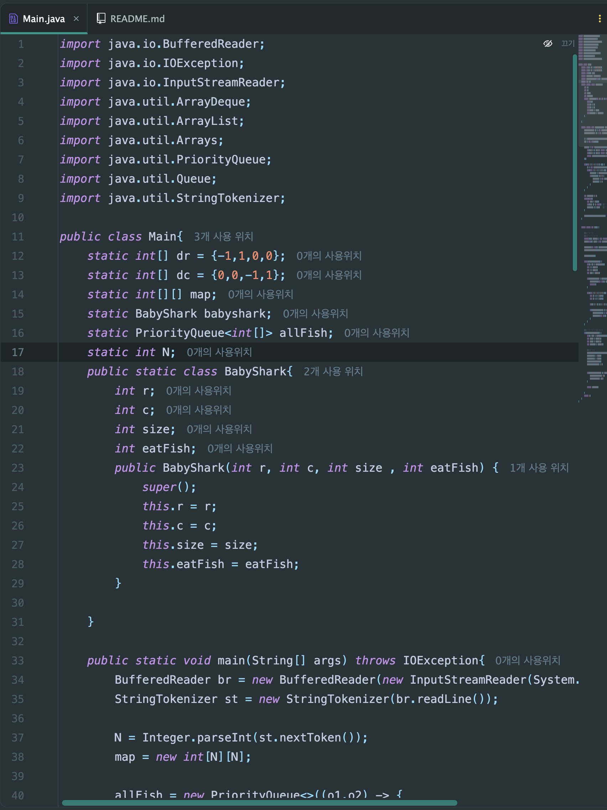
</p>

### 코드 템플릿

코딩테스트에서 매번 반복되는 도입부를 템플릿으로 저장해두면 빠르게 시작할 수 있습니다. 구문 강조가 적용된 미리보기를 제공합니다.

<p align="center">
  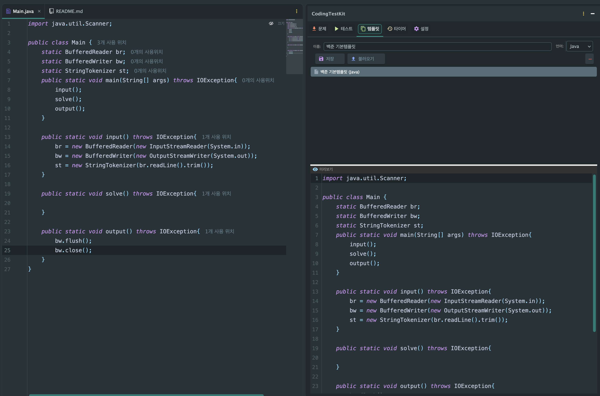
</p>

### 타이머

**스톱워치**와 **카운트다운 타이머**를 제공합니다.

- **스톱워치**: 랩 기록과 메모 기능
- **카운트다운**: 3가지 표시 모드를 체크박스로 선택 가능
  - **원형 다이얼 타이머**: 남은 시간이 빨간 원으로, 경과 시간이 빈 갭으로 시계방향으로 줄어듦
  - **디지털 시계**: 큰 숫자로 남은 시간 표시
  - **프로그레스 바**: 막대형 진행률 표시
- 30분, 1시간, 2시간, 3시간 프리셋 버튼
- 시간 종료 시 알림

<p align="center">
  
</p>

<p align="center">
  
</p>

### 설정 & 시험 모드

자동완성과 코드 검사를 끄고 켜는 **시험 모드**를 제공합니다. 실제 코딩테스트 환경과 동일한 조건에서 연습할 수 있습니다.

- **자동완성 ON/OFF**: 코드 자동완성 팝업을 끄고 켤 수 있습니다
- **코드 검사 ON/OFF**: 절전 모드를 활성화하여 백그라운드 분석을 중지합니다
- **외부 붙여넣기 차단**: 외부 프로그램에서 복사한 텍스트의 붙여넣기를 차단합니다
- **포커스 이탈 감지**: IDE 창에서 포커스가 벗어나면 경고를 표시합니다
- **언어 설정**: 한국어 / English 전환 가능 (안내문 한·영 동시 표시)

**시험 모드** 버튼을 누르면 4가지 설정이 한 번에 적용되고, **일반 모드** 버튼을 누르면 모두 해제됩니다.

<p align="center">
  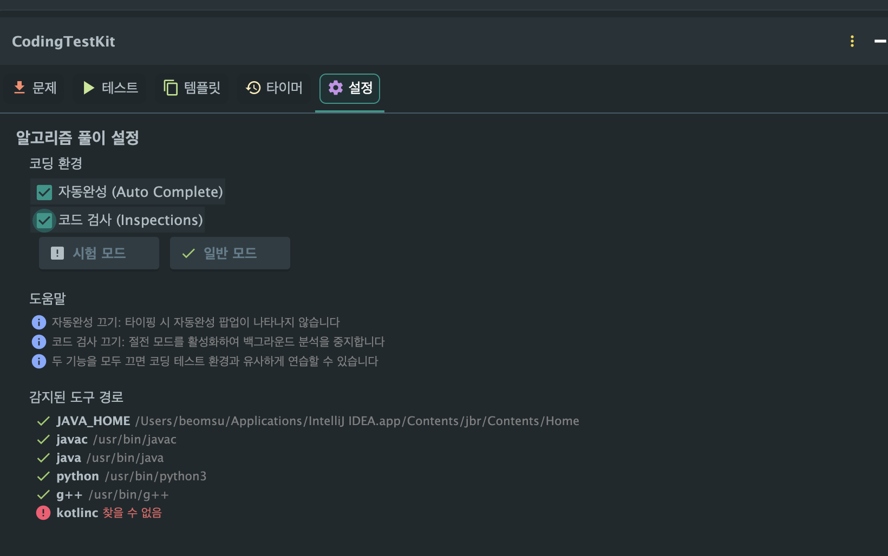
</p>

#### 시험 모드 (자동완성 OFF)

시험 모드에서는 코드 자동완성과 검사가 비활성화됩니다.

<p align="center">
  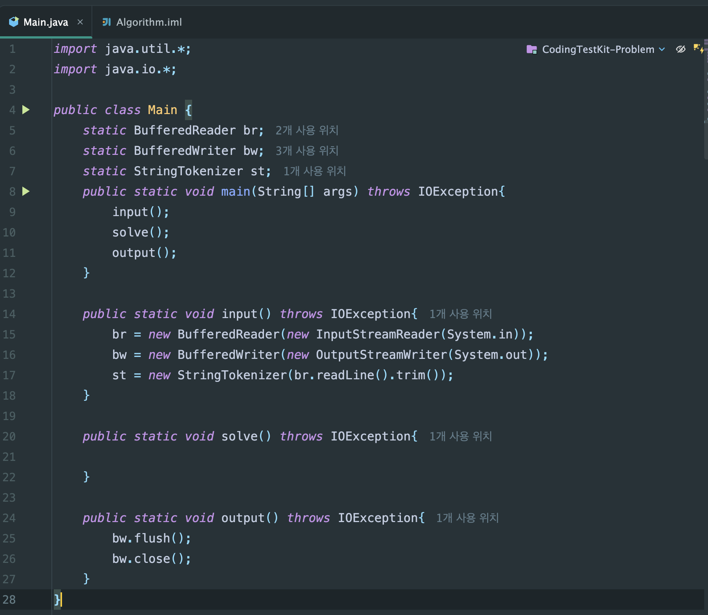
</p>

<p align="center">
  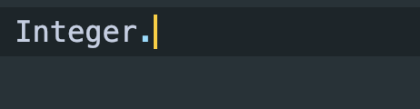
</p>

#### 일반 모드 (자동완성 ON)

<p align="center">
  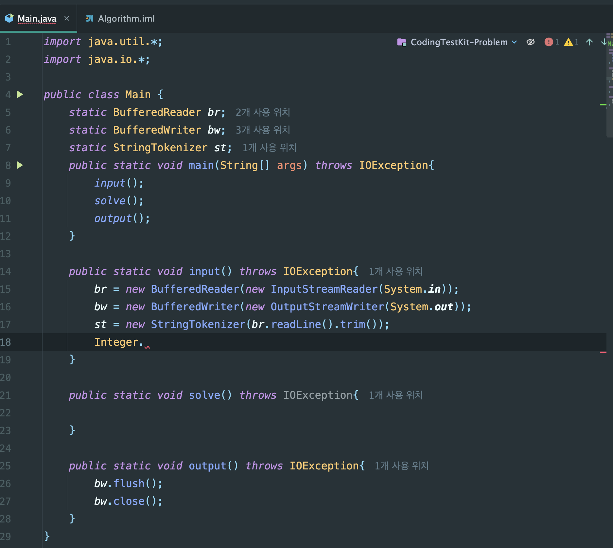
</p>

<p align="center">
  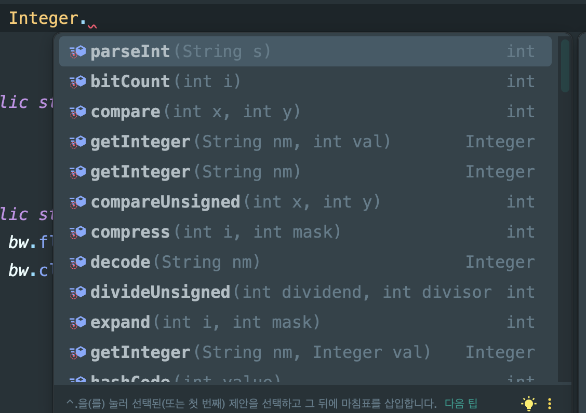
</p>

### GitHub 연동

백준허브처럼 맞은 문제를 자동으로 GitHub에 푸시합니다.

- **원클릭 로그인**: 내장 브라우저에서 GitHub에 로그인하면 토큰이 자동 생성 및 저장
- **레포 선택**: 로그인 후 드롭다운에서 레포 선택
- **자동 푸시**: 채점 결과가 "맞았습니다"일 때만 자동으로 GitHub에 커밋
- **수동 푸시**: GitHub 버튼을 눌러서 원할 때 직접 푸시
- **스마트 감지**: 틀린 코드는 절대 푸시하지 않음 — "Accepted"일 때만 동작
- **전 플랫폼 지원**: 백준, 프로그래머스, SWEA, LeetCode 모두 지원
- **구조화된 커밋**: `[플랫폼 #번호] 문제 제목 (언어)` 형식 + README 자동 생성

설정: 설정 > GitHub 연동 > "GitHub 로그인" 클릭 후 레포 선택.

---

## 설치 방법

### JetBrains Marketplace
1. IntelliJ IDEA > Settings > Plugins > Marketplace
2. "CodingTestKit" 검색 후 설치

### 수동 설치
1. [Releases](https://github.com/dj258255/codingtestkit/releases)에서 `.zip` 파일 다운로드
2. IntelliJ IDEA > Settings > Plugins > 톱니바퀴 > Install Plugin from Disk

---

## 사용법

### 1. 문제 가져오기
1. 우측 사이드바에서 **CodingTestKit** 열기
2. 플랫폼과 언어 선택
3. 문제 번호 입력 후 **가져오기** 클릭
   - 백준: `1000` (문제 번호)
   - 프로그래머스: `12947` (URL의 `/lessons/` 뒤 숫자)
   - SWEA: `1204` (문제 번호)
   - LeetCode: `1` 또는 `two-sum` 또는 URL

### 2. 문제 검색 & 랜덤
- **검색**: 백준(solved.ac)과 LeetCode에서 키워드·태그·난이도로 문제 검색
- **랜덤**: 티어/클래스 범위, 태그, 옵션을 설정하고 문제를 랜덤으로 뽑기
- 프로그래머스·SWEA는 검색/랜덤 미지원

### 3. 로그인
1. **로그인** 버튼 클릭
2. 내장 브라우저에서 해당 플랫폼에 로그인
3. 로그인 감지 시 자동으로 쿠키 저장 및 닫힘

### 4. 테스트 실행
1. **테스트** 탭 이동
2. 코드 작성 후 **전체 실행** 클릭
3. PASS/FAIL 결과 확인 (FAIL 시 자동 펼침)

### 5. 코드 제출
1. **제출** 버튼 클릭
2. 내장 브라우저에서 코드 자동 입력 확인
3. 제출 버튼 클릭 후 결과 확인

---

## 요구 사항

- IntelliJ IDEA 2024.1 이상
- JDK 17 이상 (Java 실행용)
- 각 언어 컴파일러 (해당 언어 테스트 시)

## 빌드

```bash
./gradlew buildPlugin
```

빌드된 플러그인은 `build/distributions/` 폴더에 생성됩니다.

## 라이선스

MIT License

## 제작자

- **dj258255** - [GitHub](https://github.com/dj258255)
