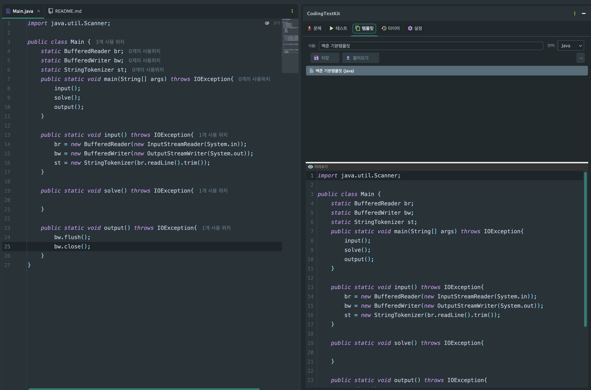

# Code Templates / 코드 템플릿

<p align="center">
  <a href="../../README.md"><b>← Back to README</b></a>
</p>

---

## English

Save frequently used boilerplate as templates, and let each platform start new problems from the one you actually want. Syntax-highlighted preview included.

### Saving

Click **Save** and pick what to save — the whole editor, just the current selection, or a file from disk. The template name is asked last, after the content is settled. The language is taken from the file you saved, so a `.py` file is stored as Python even if the combo shows something else.

### Loading

Right-click a template for **Load into Editor**, **Set as Platform Default**, and **Delete**.

If the editor already has code, loading asks first: **Replace all**, **Insert at cursor**, or **Cancel** — an in-progress solution is never overwritten silently.

### Platform defaults

Mark a template as the default for one or more platforms (Codeforces, LeetCode, …) from the right-click menu; a ★ badge shows which. New problems from that platform then start from your template instead of the built-in stub. Defaults are per platform **and** language, so a Java default and a Python default coexist.

### Keeping LeetCode's `Solution` class

LeetCode requires a specific `Solution` class whose signature differs per problem, so your template cannot spell it out in advance. Put `{{SOLUTION}}` where the problem's stub should go:

```java
import java.util.*;

// my helpers
{{SOLUTION}}
```

The plugin substitutes the problem's own stub at that spot — both when a new problem is created and when you load the template onto an existing problem file. Without the placeholder, the stub is appended below your template so the submission stays valid. On platforms with no per-problem stub (Codeforces and friends) only your template is used, so `main` is never duplicated.

<p align="center">
  
</p>

---

## 한국어

자주 쓰는 코드를 템플릿으로 저장하고, 플랫폼마다 원하는 템플릿으로 새 문제를 시작할 수 있습니다. 구문 강조 미리보기를 제공합니다.

### 저장

**저장**을 누르면 무엇을 저장할지 먼저 묻습니다 — 에디터 전체, 선택 영역, 또는 파일. 이름은 내용이 정해진 다음 마지막에 입력합니다. 언어는 저장한 파일의 확장자에서 판별하므로, 콤보가 다른 언어를 가리키고 있어도 `.py` 파일은 Python으로 저장됩니다.

### 불러오기

템플릿을 우클릭하면 **에디터에 불러오기**, **플랫폼 기본으로 지정**, **삭제**가 나옵니다.

에디터에 작성 중인 코드가 있으면 먼저 묻습니다 — **전체 교체** / **커서 위치에 삽입** / **취소**. 작업 중인 풀이가 말없이 덮어써지는 일은 없습니다.

### 플랫폼 기본 템플릿

우클릭 메뉴에서 템플릿을 하나 이상의 플랫폼(코드포스·리트코드 등) 기본으로 지정하면 ★ 배지가 붙고, 그 플랫폼에서 새 문제를 열 때 내장 스텁 대신 이 템플릿으로 시작합니다. 지정은 **플랫폼 × 언어**별이라 Java 기본과 Python 기본이 각각 따로 존재합니다.

### 리트코드 `Solution` 클래스 유지

리트코드는 문제마다 시그니처가 다른 `Solution` 클래스를 요구해서 템플릿이 미리 적어둘 수 없습니다. 문제별 스텁이 들어갈 자리에 `{{SOLUTION}}`을 넣으세요:

```java
import java.util.*;

// 내 헬퍼들
{{SOLUTION}}
```

새 문제를 만들 때는 물론, 기존 문제 파일에 템플릿을 불러올 때도 그 자리에 문제의 스텁이 들어갑니다. 자리표시자가 없으면 템플릿 아래에 스텁을 덧붙여 제출 호환을 유지합니다. 문제별 스텁이 없는 플랫폼(코드포스 등)에서는 템플릿만 사용하므로 `main`이 중복되지 않습니다.
