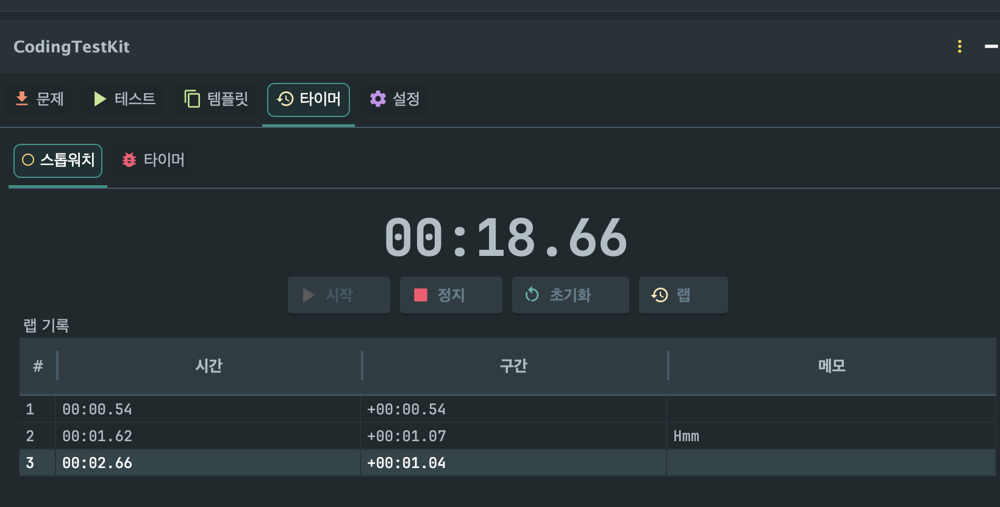
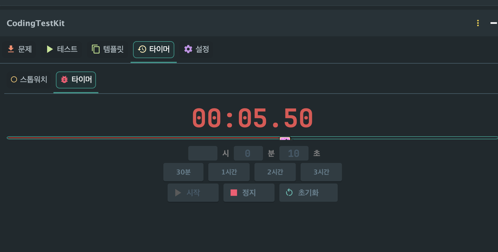

# Timer / 타이머

  <a href="../../README.md"><b>← Back to README</b></a>

---

## English

Provides a **Stopwatch** and a **Countdown Timer** to help you practice under timed conditions.

### Stopwatch

- Start / Stop / Reset controls
- **Lap records** with memo — add notes to each lap
- Lap history table

  

### Countdown Timer

3 display modes selectable via checkboxes (can combine):

| Mode | Description |
|------|-------------|
| **Circular Dial** | Remaining time as a red circle, elapsed time as a white gap growing clockwise |
| **Digital Clock** | Large numerical time display |
| **Progress Bar** | Linear progress indicator |

- Preset buttons: 30min, 1hr, 2hr, 3hr
- Notification alert when time's up

  

---

## 한국어

**스톱워치**와 **카운트다운 타이머**로 시간 제한 연습이 가능합니다.

### 스톱워치

- 시작 / 정지 / 리셋
- **랩 기록** + 메모 기능 — 각 랩에 메모 추가 가능
- 랩 기록 테이블

### 카운트다운 타이머

3가지 표시 모드를 체크박스로 선택 (조합 가능):

| 모드 | 설명 |
|------|------|
| **원형 다이얼** | 남은 시간이 빨간 원, 경과 시간이 빈 갭으로 시계방향 감소 |
| **디지털 시계** | 큰 숫자로 남은 시간 표시 |
| **프로그레스 바** | 막대형 진행률 표시 |

- 프리셋 버튼: 30분, 1시간, 2시간, 3시간
- 시간 종료 시 알림
